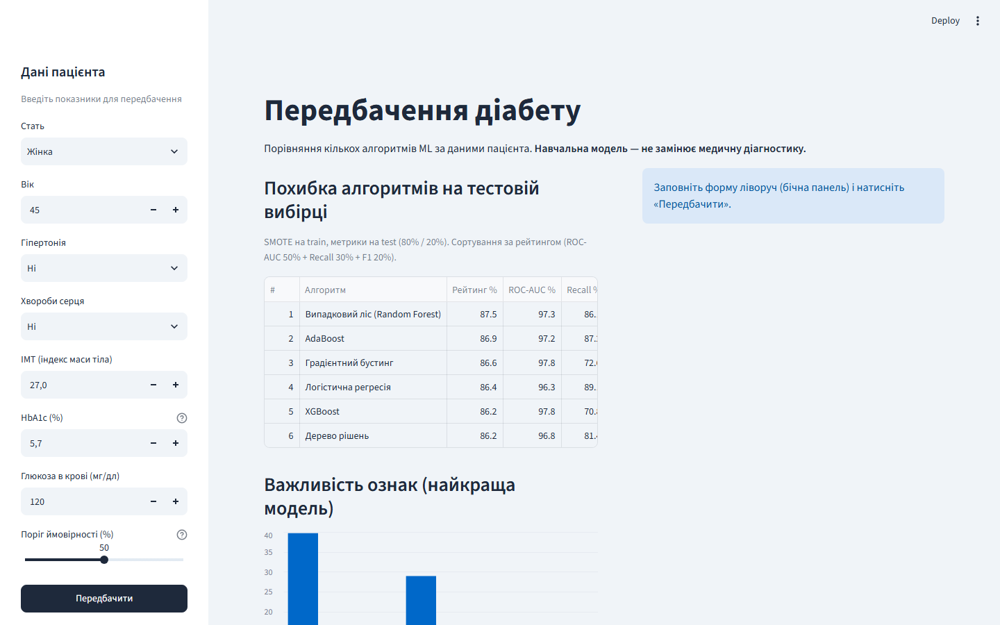
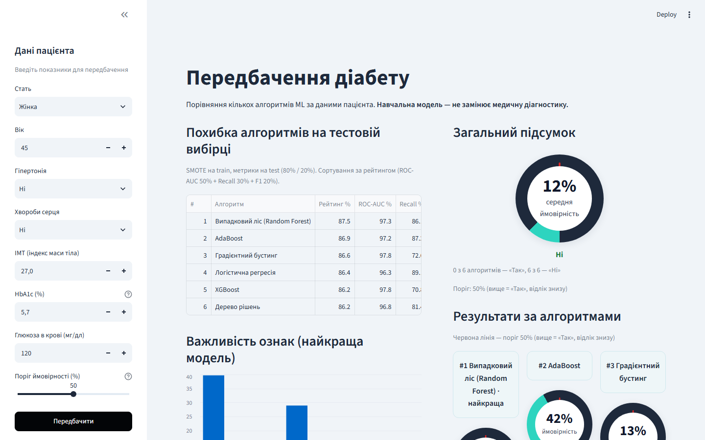
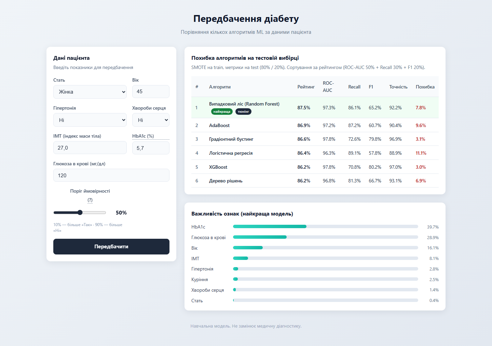
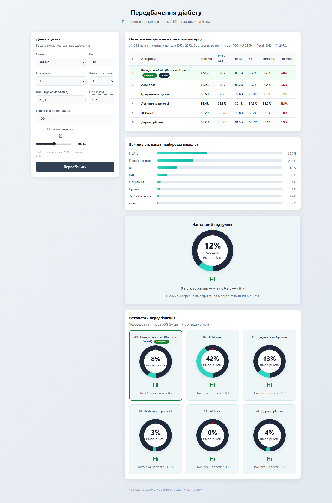

# Передбачення діабету (ML + Streamlit / Flask)

Навчальний проєкт: порівняння кількох алгоритмів машинного навчання для оцінки ймовірності діабету за показниками пацієнта.

> **Увага:** модель навчальна і **не замінює** медичну діагностику.

## Скріншоти

### Streamlit

#### Головна сторінка (метрики + форма)



#### Результати передбачення



### Flask

#### Головна сторінка (метрики + форма)



#### Результати передбачення



## Можливості

- 6 алгоритмів: Random Forest, XGBoost, градієнтний бустинг, AdaBoost, дерево рішень, логістична регресія
- SMOTE на train-вибірці, метрики на test (80/20)
- композитний **рейтинг** моделей (ROC-AUC 50% + Recall 30% + F1 20%)
- гіперпараметричний тюнінг топ-2 моделей
- веб-форма з **слайдером порогу** ймовірності
- UI на **Streamlit** (деплой на [Streamlit Community Cloud](https://streamlit.io/cloud)) + локальний Flask
- unit-тести (`pytest`)

## Структура

```
ProjectAILearning/
├── streamlit_app.py            # головний UI для Streamlit Cloud
├── app.py                      # Flask UI (локально, опційно) + спільні хелпери
├── train_diabetes_model.py     # навчання та збереження моделей
├── predict_diabetes.py         # передбачення
├── model_registry.py           # реєстр алгоритмів / pipelines
├── validators.py               # валідація даних пацієнта
├── config.py                   # шляхи та константи
├── exceptions.py               # користувацькі винятки
├── diabetes_models.joblib      # навчені моделі (потрібні для деплою)
├── diabetes_prediction_dataset.csv
├── model_metrics.json
├── feature_importance.json
├── .streamlit/config.toml      # тема Streamlit
├── packages.txt                # системні пакети для Linux (Cloud)
├── docs/screenshots/           # скріншоти для README
├── templates/ / static/        # Flask UI
├── Dockerfile                  # образ для Streamlit / Flask
├── docker-compose.yml          # запуск у контейнері
├── requirements-docker.txt     # залежності образу (без pytest, xgboost CPU)
├── tests/
└── requirements.txt
```

## Вимоги

- Python 3.10+ 
- залежності з `requirements.txt`

## Швидкий старт (локально)

```bash
git clone https://github.com/prostir06/ProjectAILearning.git
cd ProjectAILearning

python -m venv .venv
# Windows: .venv\Scripts\activate
# macOS/Linux: source .venv/bin/activate

pip install -r requirements.txt
```

### Streamlit (основний веб-UI)

```bash
streamlit run streamlit_app.py
```

Якщо `diabetes_models.joblib` відсутній, додаток спробує швидко навчити моделі без тюнінгу при першому старті.

### Flask (опційно)

```bash
python app.py
```

Відкрийте [http://127.0.0.1:5000](http://127.0.0.1:5000). Debug: `FLASK_DEBUG=1`.

### Навчання моделей вручну

```bash
python train_diabetes_model.py
```

### Тести

```bash
python -m pytest tests/ -v
```

## Docker

Потрібні [Docker](https://docs.docker.com/get-docker/) та Docker Compose.

### Streamlit (основний UI)

```bash
docker compose up --build
```

Відкрийте [http://localhost:8501](http://localhost:8501).

### Flask (опційно)

```bash
docker compose --profile flask up --build
```

Відкрийте [http://localhost:5000](http://localhost:5000).

### Окремі команди

```bash
# лише Streamlit
docker build -t diabetes-prediction .
docker run --rm -p 8501:8501 diabetes-prediction

# лише Flask
docker run --rm -p 5000:5000 -e HOST=0.0.0.0 diabetes-prediction python app.py
```

## Деплой на Streamlit Community Cloud

1. Зайдіть на [share.streamlit.io](https://share.streamlit.io) / Cloud і увійдіть через GitHub.
2. **New app** → репозиторій `prostir06/ProjectAILearning`, гілка `main`.
3. **Main file path:** `streamlit_app.py`
4. Натисніть **Deploy**.

Cloud установить залежності з `requirements.txt` і системні пакети з `packages.txt` (потрібно для XGBoost на Linux).

Публічний репозиторій: https://github.com/prostir06/ProjectAILearning

## Ліцензія даних

Датасет `diabetes_prediction_dataset.csv` — публічний навчальний набір. Перед комерційним використанням перевірте умови ліцензії оригінального джерела.
