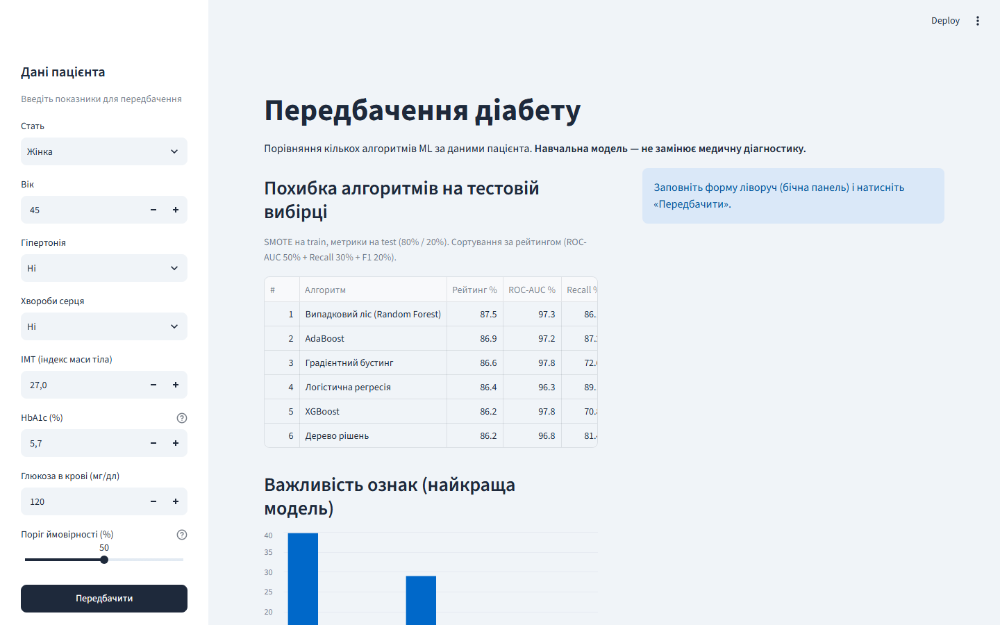
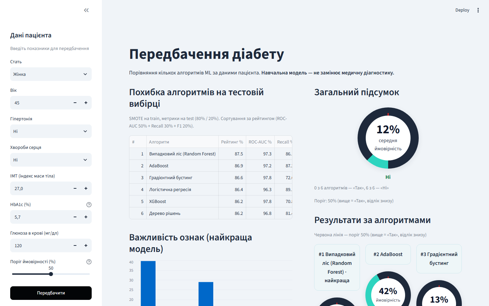

# Передбачення діабету (ML + Streamlit / Flask)

Навчальний проєкт: порівняння кількох алгоритмів машинного навчання для оцінки ймовірності діабету за показниками пацієнта.

> **Увага:** модель навчальна і **не замінює** медичну діагностику.

## Скріншоти

### Streamlit

#### Головна сторінка (метрики + форма)



#### Результати передбачення



### Flask

#### Головна сторінка (метрики + форма)


#### Результати передбачення


## Можливості

- 6 алгоритмів: Random Forest, XGBoost, градієнтний бустинг, AdaBoost, дерево рішень, логістична регресія
- **3-way split** (train / validation / test): вибір і тюнінг на validation, фінальні метрики на test
- SMOTE лише для логістичної регресії; для дерев/бустингу — `class_weight` / `scale_pos_weight`
- композитний **рейтинг** (ROC-AUC 50% + Recall 30% + F1 20%) + PR-AUC
- гіперпараметричний тюнінг топ-2 моделей (scoring узгоджений із рейтингом)
- оптимальний поріг на validation (Youden) → default у UI
- зважений ensemble-підсумок; режим передбачення `all` | `best`
- веб-форма зі слайдером порогу та історією куріння
- UI: **Streamlit** (Cloud) + **Flask** (Waitress, CSRF, `/health`, `/api/predict`, `/api/explain`)
- Docker (non-root), CI (GitHub Actions), unit-тести (`pytest`)

## Структура

```
ProjectAILearning/
├── streamlit_app.py            # головний UI для Streamlit Cloud
├── app.py                      # Flask UI + REST API
├── train_diabetes_model.py     # навчання (CLI: --no-tune, --models, --sample)
├── predict_diabetes.py         # передбачення (mode=all|best)
├── model_registry.py           # реєстр алгоритмів / pipelines
├── scoring.py                  # єдиний selection_score
├── ui_helpers.py               # спільні HTML donut-хелпери
├── bootstrap_models.py         # cold-start навчання
├── explainability.py           # важливість ознак для /api/explain
├── validators.py / config.py / exceptions.py
├── diabetes_models.joblib      # повний пакет моделей (деплой)
├── .github/workflows/ci.yml
├── Dockerfile / docker-compose.yml
├── templates/ / static/
├── tests/
└── requirements.txt
```

## Вимоги

- Python 3.10+
- залежності з `requirements.txt`

## Швидкий старт (локально)

```bash
git clone https://github.com/prostir06/ProjectAILearning.git
cd ProjectAILearning

python -m venv .venv
# Windows: .venv\Scripts\activate
# macOS/Linux: source .venv/bin/activate

pip install -r requirements.txt
```

### Streamlit (основний веб-UI)

```bash
streamlit run streamlit_app.py
```

Якщо `diabetes_models.joblib` відсутній, додаток швидко навчить моделі без тюнінгу
(`QUICK_TRAIN_MAX_ROWS`, за замовчуванням 20000). Для продакшену комітьте готовий joblib.

### Flask

```bash
python app.py
```

Відкрийте [http://127.0.0.1:5000](http://127.0.0.1:5000).  
Health: `GET /health`. API: `POST /api/predict`, `GET /api/explain`.  
Debug: `FLASK_DEBUG=1`. Секрет: `FLASK_SECRET_KEY`.

### Навчання моделей

```bash
python train_diabetes_model.py
python train_diabetes_model.py --no-tune --sample 20000
python train_diabetes_model.py --models rf,xgb --serve-best-only
```

### Тести

```bash
python -m pytest tests/ -v
```

## Docker

```bash
docker compose up --build                 # Streamlit :8501
docker compose --profile flask up --build # + Flask :5000 (Waitress)
```

## Деплой на Streamlit Community Cloud

1. [share.streamlit.io](https://share.streamlit.io) → GitHub.
2. Репозиторій `prostir06/ProjectAILearning`, гілка `main`.
3. **Main file path:** `streamlit_app.py` → **Deploy**.

Cloud: `requirements.txt` + `packages.txt` (`libgomp1` для XGBoost).

Публічний репозиторій: https://github.com/prostir06/ProjectAILearning

## Ліцензія даних

Датасет `diabetes_prediction_dataset.csv` — публічний навчальний набір. Перед комерційним використанням перевірте умови ліцензії оригінального джерела.
