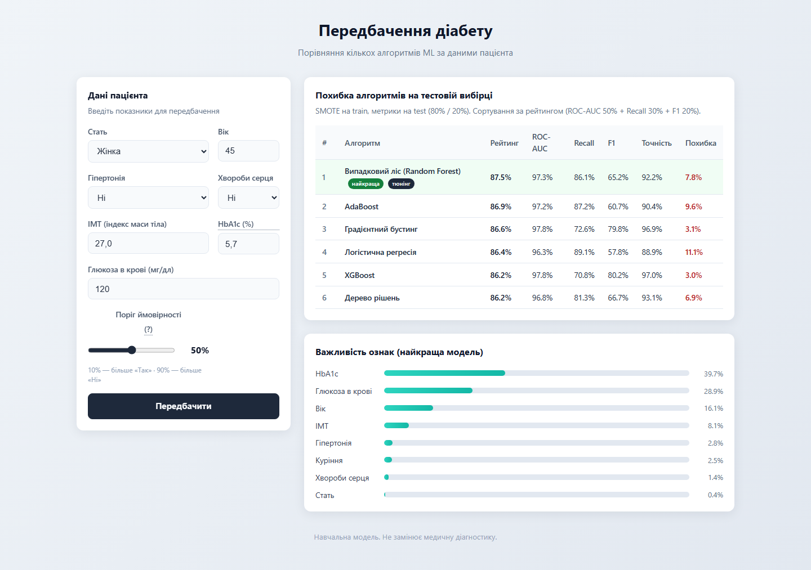
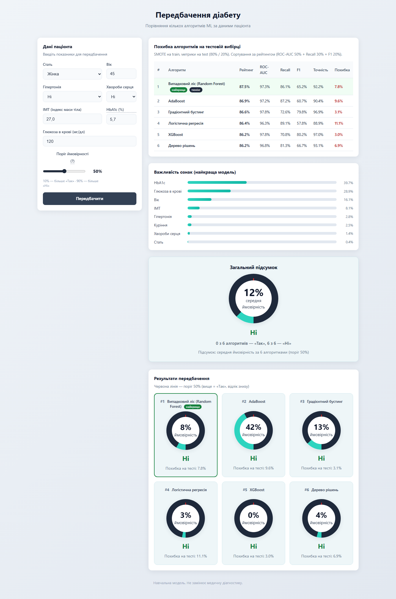

# Передбачення діабету (ML + Flask)

Навчальний проєкт: порівняння кількох алгоритмів машинного навчання для оцінки ймовірності діабету за показниками пацієнта.

> **Увага:** модель навчальна і **не замінює** медичну діагностику.

## Скріншоти

#### Головна сторінка (метрики + форма)



#### Результати передбачення



## Можливості

- 6 алгоритмів: Random Forest, XGBoost, градієнтний бустинг, AdaBoost, дерево рішень, логістична регресія
- **3-way split** (train / validation / test): вибір і тюнінг на validation, фінальні метрики на test
- SMOTE лише для логістичної регресії; для дерев/бустингу — `class_weight` / `scale_pos_weight`
- композитний **рейтинг** (ROC-AUC 50% + Recall 30% + F1 20%) + PR-AUC
- гіперпараметричний тюнінг топ-2 моделей
- оптимальний поріг на validation (Youden) → default у UI
- зважений ensemble-підсумок; режим передбачення `all` | `best`
- веб-форма зі слайдером порогу та історією куріння
- **Flask** UI (Waitress, CSRF) + API: `/health`, `/api/predict`, `/api/explain`
- Docker (non-root), CI (GitHub Actions), unit-тести (`pytest`)

## Структура

```
ProjectAILearning/
├── diabetes/
│   ├── core/                 # config, exceptions, validators, scoring
│   ├── ml/                   # data, train, tune, persist, predict, registry
│   └── web/                  # create_app + forms + wsgi
├── run.py                    # Flask / Waitress entrypoint
├── train.py                  # CLI навчання
├── diabetes_models.joblib    # повний пакет моделей (деплой)
├── .github/workflows/ci.yml
├── Dockerfile / docker-compose.yml
├── templates/ / static/
├── tests/
└── requirements.txt
```

## Вимоги

- Python 3.10+
- залежності з `requirements.txt`

## Швидкий старт (локально)

```bash
git clone https://github.com/prostir06/ProjectAILearning.git
cd ProjectAILearning

python -m venv .venv
# Windows: .venv\Scripts\activate
# macOS/Linux: source .venv/bin/activate

pip install -r requirements.txt
```

### Flask UI

```bash
python run.py
```

Відкрийте [http://127.0.0.1:5000](http://127.0.0.1:5000).

Якщо `diabetes_models.joblib` відсутній, UI покаже підказку навчити моделі:
`python train.py` (без авто-навчання на GET /). Для продакшену кладіть готовий joblib у образ.

- Health: `GET /health`
- API: `POST /api/predict`, `GET /api/explain`
- Debug: `FLASK_DEBUG=1`
- Секрет і змінні: скопіюйте [`.env.example`](.env.example) → `.env`

#### Приклад API (`POST /api/predict`)

```json
{
  "gender": "Female",
  "age": 54,
  "hypertension": 0,
  "heart_disease": 0,
  "smoking_history": "No Info",
  "bmi": 27.32,
  "HbA1c_level": 6.6,
  "blood_glucose_level": 140,
  "threshold": 50,
  "mode": "all"
}
```

`threshold` — відсотки (50) або частка (0.5). `mode`: `all` | `best`.

### Навчання моделей

```bash
python train.py
python train.py --no-tune --sample 20000
python train.py --models rf,xgb --serve-best-only
```

### Тести

```bash
python -m pytest tests/ -v
```

## Docker

```bash
docker compose up --build
# → http://localhost:5001
```

Або:

```bash
docker build -t diabetes-prediction .
docker run --rm -p 5001:5000 -e FLASK_SECRET_KEY=change-me diabetes-prediction
```

Публічний репозиторій: https://github.com/prostir06/ProjectAILearning

## Ліцензія даних

Датасет `diabetes_prediction_dataset.csv` — публічний навчальний набір. Перед комерційним використанням перевірте умови ліцензії оригінального джерела.
